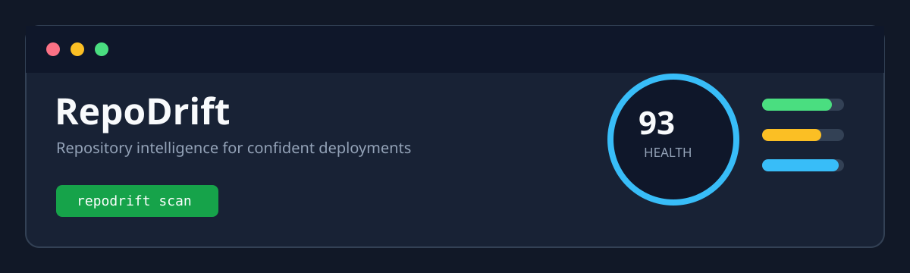

# RepoDrift



RepoDrift is a local-first repository intelligence CLI for developers. It analyzes a project before development or deployment and reports repository health, dependencies, security patterns, Git status, code metrics, and actionable findings.

> Current release: Phase 1 local analysis. AI explanations and a remote API are planned, but are not enabled yet.

## Quick Start

Requirements:

- Node.js 20 or newer
- npm

Install and build:

```bash
npm install
npm run build
npm link
```

Install the published CLI:

```bash
npm install -g @repodrift/cli
```

Scan the current repository:

```bash
repodrift scan
```

Scan another repository:

```bash
repodrift scan ./my-project
```

## Commands and Options

```bash
repodrift scan                 # Human-readable report
repodrift scan --verbose       # Include Git and code metrics
repodrift scan --json          # Machine-readable JSON
repodrift scan --local-only    # Never run network-backed dependency audit
repodrift scan --fail-on high  # Exit non-zero for high or critical findings
```

The same command can be run during development without linking:

```bash
npm run dev -- scan
npm run dev -- scan --json
```

Exit codes are intended for CI use:

- `0`: No findings at or above the selected threshold
- `1`: Warning or high-severity findings
- `2`: Critical findings

## What RepoDrift Checks

### File scanner

- Files and directories
- File extensions and source files
- Test, configuration, and documentation files
- Binary and large files
- Ignored directories: `node_modules`, `.git`, `dist`, `build`, `.next`, `coverage`, and `.cache`
- Custom patterns in `.repodriftignore`

### Dependency analyzer

- `package.json` dependencies and dev dependencies
- npm, Yarn, and pnpm lockfiles
- Missing lockfiles
- Deprecated package metadata in `package-lock.json`
- Known npm advisories through `npm audit` when network auditing is allowed

### Security scanner

- API keys and tokens
- AWS and GitHub credentials
- Private key markers
- Hardcoded passwords and secrets
- Database connection URLs
- `.env` files

Raw secrets are not sent to an AI service. Use `--local-only` to guarantee that RepoDrift does not make a network request.

### Git and code metrics

- Current branch and working tree status
- Commit count, contributors, recent commits, and uncommitted files
- Lines of code and largest source file
- Deterministic repository health score and grade

## Project Structure

```text
repodrift/
├── src/
│   ├── index.ts                 # Commander CLI entrypoint
│   ├── commands/
│   │   ├── scan.ts              # Scan command extension point
│   │   └── explain.ts           # Future AI explanation command
│   ├── core/
│   │   ├── engine.ts            # Orchestrates local analysis and scoring
│   │   ├── types.ts             # Shared TypeScript contracts
│   │   ├── scanner.ts           # Filesystem scanning and classification
│   │   ├── dependencies.ts      # Manifest, lockfile, and npm audit checks
│   │   ├── security.ts          # Local credential pattern detection
│   │   ├── git.ts               # Local Git CLI analysis
│   │   └── metrics.ts           # Source metrics and quality findings
│   └── ai/
│       ├── client.ts            # Future provider abstraction
│       ├── analyzer.ts          # Future AI analysis service
│       └── prompts.ts           # Future prompt definitions
├── test/
│   └── core.test.ts             # Analyzer and scoring tests
├── docs/
│   └── images/
│       └── repodrift-banner.svg  # Original project banner
├── dist/                        # TypeScript build output
├── LICENSE                      # MIT license
├── package.json
├── package-lock.json
└── tsconfig.json
```

## Development

Run tests and compile the project:

```bash
npm test
npm run build
```

The test suite uses Node's built-in test runner through `tsx` and covers file scanning, ignore patterns, secret detection, dependency checks, deprecated packages, and score calculation.

RepoDrift never executes repository scripts or application code during a scan. Git analysis is optional and gracefully becomes unavailable when Git is not installed or the target is not a Git repository.

## Docker and CI

RepoDrift can scan a mounted repository in a container. The image must contain Node.js and Git if Git analysis is required:

```bash
docker run --rm \
  -v "$PWD:/repo" \
  -w /repo \
  node:22-bookworm \
  npx --yes tsx /path/to/repodrift/src/index.ts scan --local-only
```

For CI, JSON output is designed for machine processing:

```bash
repodrift scan --json --fail-on high
```

## Roadmap

- Phase 2: expanded code quality, complexity, configuration, and CI fixtures
- Phase 3: replaceable AI providers, redacted AI payloads, and explanations
- Phase 4: API, historical scans, database, and dashboard

## License

MIT
